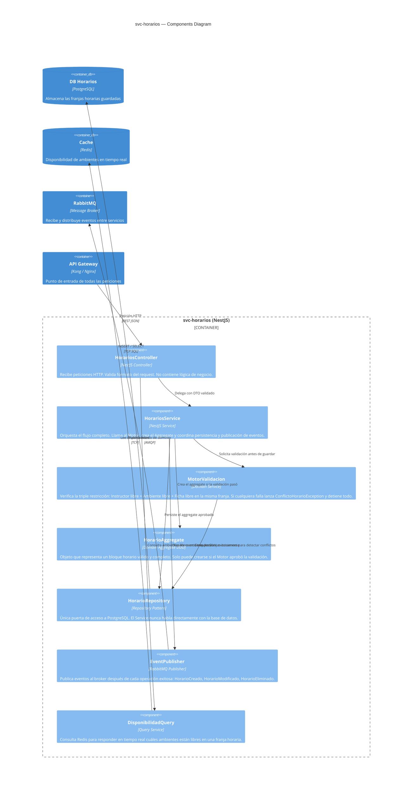

Aquí va el nivel 3 limpio, listo para pegar directo en el `.md`:

---

# C4 Model — Nivel 3: Components Diagram

> PRJ-EDU-HORARIOS | svc-horarios — El corazón del sistema
> Última actualización: 2026-05-20

---

## ¿Qué muestra este nivel?

Entramos dentro de `svc-horarios` y mostramos sus piezas internas.

Responde a: **¿Cómo está organizado el código por dentro y qué hace cada pieza?**

Los otros servicios siguen la misma estructura. Se documenta primero `svc-horarios` porque contiene la lógica más importante: el motor que impide los cruces de horarios.

---

## Flujo de una petición — paso a paso

Cuando el Coordinador intenta crear un bloque horario, esto es lo que ocurre internamente:

```
Petición HTTP entrante
        │
        ▼
┌─────────────────────┐
│  1. Controller      │  Recibe la petición. Verifica que los campos estén completos
│  HorariosController │  y con el formato correcto. No toma decisiones de negocio.
└────────┬────────────┘
         │
         ▼
┌─────────────────────┐
│  2. Service         │  Director de orquesta. Coordina todos los pasos.
│  HorariosService    │  Llama al Motor de Validación ANTES de intentar guardar.
└────────┬────────────┘
         │
         ▼
┌─────────────────────┐
│  3. MotorValidacion │  ⭐ Pieza más importante. Verifica que no haya cruces:
│                     │  → ¿El instructor ya tiene clase a esa hora?
│                     │  → ¿El ambiente ya está ocupado a esa hora?
│                     │  → ¿La ficha (grupo) ya tiene clase a esa hora?
│                     │
│                     │  Si ALGUNA falla → lanza error. No continúa. No guarda nada.
│                     │  Si TODAS pasan  → da luz verde al Service.
└────────┬────────────┘
         │
         ▼
┌─────────────────────┐
│  4. HorarioAggregate│  Crea el objeto de horario válido con todos sus datos.
│                     │  Solo puede existir si el Motor dio luz verde.
└────────┬────────────┘
         │
         ▼
┌─────────────────────┐
│  5. Repository      │  Guarda el horario en PostgreSQL.
│  HorarioRepository  │  Es la única pieza que habla con la base de datos.
└────────┬────────────┘
         │
         ▼
┌─────────────────────┐
│  6. EventPublisher  │  Avisa al resto del sistema que se creó un horario nuevo.
│                     │  Publica el evento en RabbitMQ para que otros servicios
│                     │  como svc-reportes y svc-observaciones se enteren.
└─────────────────────┘
```

---

## Diagrama C4



---

## Descripción detallada de cada componente

---

### 1 — HorariosController

**¿Qué hace?**
Es la puerta de entrada al servicio. Recibe las peticiones HTTP que vienen del API Gateway y verifica que tengan el formato correcto: que los campos obligatorios estén presentes y con el tipo de dato esperado.

**¿Qué NO hace?**
No toma ninguna decisión de negocio. No sabe si hay conflictos. No sabe si un instructor está disponible. Eso le corresponde al Motor de Validación.

**Endpoints que expone:**

| Método | Ruta | Qué hace |
|---|---|---|
| POST | `/horarios` | Crear un nuevo bloque horario |
| GET | `/horarios/:id` | Consultar un bloque por ID |
| PUT | `/horarios/:id` | Modificar un bloque existente |
| DELETE | `/horarios/:id` | Eliminar un bloque |
| GET | `/horarios/disponibilidad` | Ver qué ambientes están libres en una franja |

---

### 2 — HorariosService

**¿Qué hace?**
Es el director de orquesta. Recibe la solicitud del Controller ya con el formato validado, y coordina todos los pasos: primero valida, luego crea el aggregate, luego guarda, luego publica el evento.

**Regla de oro:**
Nunca accede directamente a la base de datos. Siempre delega en el Repository. Esto permite cambiar la BD en el futuro sin tocar la lógica del Service.

---

### 3 — MotorValidacion ⭐ El más importante

**¿Qué hace?**
Es el guardián del sistema. Antes de que se guarde cualquier horario, verifica las tres condiciones que definen si una asignación es válida:

| Restricción | Pregunta que responde |
|---|---|
| **Instructor** | ¿Ya tiene asignada otra clase en ese mismo día y hora? |
| **Ambiente** | ¿Ese salón o laboratorio ya está ocupado en esa franja? |
| **Ficha** | ¿Ese grupo de aprendices ya tiene clase en ese momento? |

**Resultado:**

- ✅ Las tres condiciones pasan → el Service puede continuar y guardar
- ❌ Alguna condición falla → se lanza `ConflictoHorarioException` con el detalle exacto del cruce y el proceso se detiene completamente

**Garantía del sistema:**
Es técnicamente imposible guardar un cruce de horarios si la petición pasa por este componente. No existe en el sistema un botón de "guardar de todas formas ignorando el conflicto", porque eso destruiría la confianza en los datos.

---

### 4 — HorarioAggregate (DDD)

**¿Qué es?**
El objeto de dominio que representa un bloque horario completo y válido. No es solo una fila de base de datos: es un objeto con significado de negocio que contiene todas las piezas del horario juntas.

**Qué contiene:**

| Campo | Significado |
|---|---|
| `fichaId` | Qué grupo de aprendices tiene clase |
| `instructorId` | Quién dicta la clase |
| `ambienteId` | En qué salón o laboratorio |
| `franjaHoraria` | Cuándo: día de la semana, hora de inicio y hora de fin |
| `estado` | Si está activo o cancelado |

**Regla DDD importante:**
Este objeto solo puede ser creado después de que el MotorValidacion apruebe la asignación. Nunca se instancia directamente desde el Controller saltándose la validación.

---

### 5 — HorarioRepository

**¿Qué hace?**
Es la única pieza del servicio que habla con PostgreSQL. Todos los demás componentes que necesitan datos del horario se los piden a él, nunca van directo a la base de datos.

**¿Por qué existe esta separación?**
Si en el futuro se decide cambiar PostgreSQL por otro motor de base de datos, solo se modifica este componente. El Service, el Motor y el Aggregate no se tocan.

**Operaciones principales:**

| Método | Qué hace |
|---|---|
| `save()` | Guarda un nuevo horario |
| `findById()` | Busca un horario por su ID |
| `findByInstructor()` | Trae todos los horarios de un instructor |
| `findByAmbiente()` | Trae todos los horarios de un ambiente |
| `findByFicha()` | Trae todos los horarios de una ficha |
| `findConflictos()` | Busca si ya existe algún bloque que choque con el solicitado |

---

### 6 — EventPublisher

**¿Qué hace?**
Después de que un horario se guarda exitosamente, este componente avisa al resto del sistema publicando un evento en RabbitMQ. Los otros servicios que necesitan saber de ese cambio están suscritos y reaccionan automáticamente sin que `svc-horarios` tenga que llamarlos directamente.

**Eventos que publica:**

| Evento | Cuándo se dispara |
|---|---|
| `HorarioCreado` | Se guardó un nuevo bloque exitosamente |
| `HorarioModificado` | Se actualizó un bloque existente |
| `HorarioEliminado` | Se eliminó un bloque del sistema |

**Quién escucha estos eventos:**
- `svc-reportes` → actualiza los cálculos de carga horaria y ocupación
- `svc-observaciones` → vincula observaciones a horarios actualizados

---

### 7 — DisponibilidadQuery

**¿Qué hace?**
Responde en milisegundos a la pregunta que el Coordinador hace mientras llena el formulario: *"¿Qué ambientes están libres el martes entre 8am y 10am?"*

**¿Por qué usa Redis y no PostgreSQL directamente?**
Esta consulta se ejecuta en tiempo real, posiblemente con cada cambio en el formulario. Ir a PostgreSQL en cada momento sería demasiado lento y generaría carga innecesaria. Redis responde en microsegundos porque mantiene el estado de disponibilidad en memoria.

**¿Cómo se mantiene actualizado Redis?**
Cada vez que el EventPublisher dispara un evento de creación, modificación o eliminación, Redis se actualiza automáticamente para reflejar el nuevo estado de disponibilidad.

---

## Resumen de los otros servicios

Todos los servicios del sistema siguen la misma estructura interna. Aquí el resumen de sus componentes principales:

| Servicio | Qué hace | Tiene Aggregate | Publica eventos | Suscribe eventos |
|---|---|---|---|---|
| `svc-catalogos` | CRUD de Ambientes, Fichas e Instructores | ✅ Sí | ✅ Sí | No |
| `svc-observaciones` | Registra y hace seguimiento de observaciones | ✅ Sí | No | ✅ Sí |
| `svc-reportes` | Genera reportes de carga y ocupación | ❌ Solo lectura | No | ✅ Sí |
| `svc-auth` | Autenticación y emisión de tokens JWT | ✅ Sí | No | No |

---

> Anterior: [`level-2-containers.md`](./level-2-containers.md)
> Siguiente: [`level-4-code.md`](./level-4-code.md)

---

Listo para pegar. ¿Seguimos con algún otro documento?