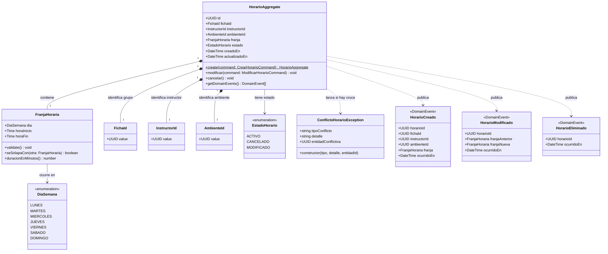
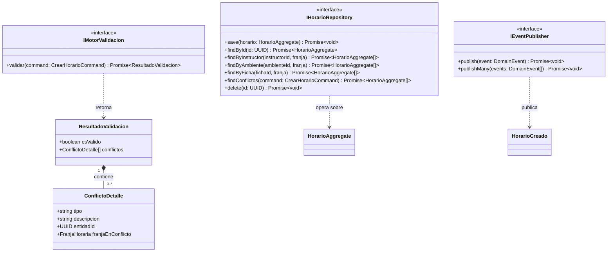

# C4 Model — Nivel 4: Code Diagram

> PRJ-EDU-HORARIOS | Detalle de clases y estructuras internas
> Última actualización: 2026-05-20

---

## ¿Qué muestra este nivel?

El nivel más detallado del modelo C4. Muestra las **clases, interfaces y relaciones**
dentro de los componentes más importantes. Este nivel es opcional en C4 pero
es clave para el equipo de desarrollo porque define exactamente cómo se estructura
el código antes de escribirlo.

Se documentan tres estructuras principales:

1. `HorarioAggregate` y sus entidades internas (DDD)
2. Organización del proyecto: **By Module** con **DDD** aplicado
3. Comparativa de enfoques: **DDD vs MVC**

---

## 1. HorarioAggregate — Diagrama de clases



---

## 2. Interfaces clave del dominio



---

## 3. Organización del proyecto — By Module con DDD

Esta es la estructura de carpetas real del código fuente de `svc-horarios`.
Está organizada **por módulo de dominio**, no por tipo de archivo.

```
svc-horarios/
│
├── src/
│   │
│   ├── horario/                          ← Módulo principal (dominio horario)
│   │   │
│   │   ├── domain/                       ← Corazón DDD: sin dependencias externas
│   │   │   ├── aggregates/
│   │   │   │   └── horario.aggregate.ts          ← HorarioAggregate
│   │   │   ├── entities/
│   │   │   │   └── franja-horaria.entity.ts      ← FranjaHoraria
│   │   │   ├── value-objects/
│   │   │   │   ├── ficha-id.vo.ts                ← FichaId
│   │   │   │   ├── instructor-id.vo.ts           ← InstructorId
│   │   │   │   ├── ambiente-id.vo.ts             ← AmbienteId
│   │   │   │   └── estado-horario.vo.ts          ← EstadoHorario (enum)
│   │   │   ├── events/
│   │   │   │   ├── horario-creado.event.ts       ← HorarioCreado
│   │   │   │   ├── horario-modificado.event.ts   ← HorarioModificado
│   │   │   │   └── horario-eliminado.event.ts    ← HorarioEliminado
│   │   │   ├── exceptions/
│   │   │   │   └── conflicto-horario.exception.ts ← ConflictoHorarioException
│   │   │   └── ports/                    ← Interfaces (lo que el dominio necesita)
│   │   │       ├── ihorario.repository.ts        ← IHorarioRepository
│   │   │       ├── imotor-validacion.ts          ← IMotorValidacion
│   │   │       └── ievent-publisher.ts           ← IEventPublisher
│   │   │
│   │   ├── application/                  ← Casos de uso. Orquesta el dominio
│   │   │   ├── commands/
│   │   │   │   ├── crear-horario.command.ts
│   │   │   │   ├── modificar-horario.command.ts
│   │   │   │   └── eliminar-horario.command.ts
│   │   │   ├── queries/
│   │   │   │   ├── obtener-horario.query.ts
│   │   │   │   └── disponibilidad-ambiente.query.ts
│   │   │   ├── handlers/
│   │   │   │   ├── crear-horario.handler.ts      ← HorariosService (orquestador)
│   │   │   │   ├── modificar-horario.handler.ts
│   │   │   │   └── disponibilidad.handler.ts
│   │   │   └── dtos/
│   │   │       ├── crear-horario.dto.ts
│   │   │       ├── modificar-horario.dto.ts
│   │   │       └── horario-response.dto.ts
│   │   │
│   │   ├── infrastructure/               ← Implementaciones concretas (BD, broker, caché)
│   │   │   ├── persistence/
│   │   │   │   ├── horario.repository.impl.ts    ← Implementa IHorarioRepository
│   │   │   │   └── horario.orm-entity.ts         ← Entidad TypeORM (mapeo BD)
│   │   │   ├── messaging/
│   │   │   │   └── rabbitmq-event-publisher.ts   ← Implementa IEventPublisher
│   │   │   ├── cache/
│   │   │   │   └── redis-disponibilidad.cache.ts ← Implementa DisponibilidadQuery
│   │   │   └── validacion/
│   │   │       └── motor-validacion.impl.ts      ← Implementa IMotorValidacion
│   │   │
│   │   └── interface/                    ← Entrada HTTP al servicio
│   │       ├── horarios.controller.ts            ← HorariosController
│   │       └── horarios.module.ts                ← Módulo NestJS (inyección dependencias)
│   │
│   ├── shared/                           ← Código compartido entre módulos
│   │   ├── domain/
│   │   │   ├── base-aggregate.ts                 ← Clase base para aggregates
│   │   │   ├── base-event.ts                     ← Clase base para eventos
│   │   │   └── value-object.ts                   ← Clase base para value objects
│   │   └── infrastructure/
│   │       └── uuid.generator.ts
│   │
│   └── main.ts                           ← Bootstrap de NestJS
│
├── test/
│   ├── unit/
│   │   └── horario/
│   │       ├── motor-validacion.spec.ts          ← Tests del motor (TDD)
│   │       └── horario.aggregate.spec.ts         ← Tests del aggregate
│   └── integration/
│       └── horario.repository.spec.ts
│
├── package.json
├── tsconfig.json
└── Dockerfile
```

---

## 4. DDD vs MVC — Comparativa aplicada al proyecto

Esta tabla explica cuándo aplica cada enfoque dentro de `PRJ-EDU-HORARIOS`:

| Aspecto | MVC clásico | DDD (este proyecto) |
|---|---|---|
| **Dónde vive la lógica** | En el Controller o el Service directamente | En el Aggregate y los Domain Services |
| **Qué representa un Model** | Una tabla de BD mapeada (ORM puro) | Un objeto de negocio con comportamiento y reglas |
| **Validación de negocio** | Dentro del Service o con decoradores del DTO | En el Aggregate (`create()`) y en el MotorValidacion |
| **Cómo se comunican servicios** | Llamadas directas entre servicios (acoplado) | Eventos de dominio publicados en el broker (desacoplado) |
| **Cómo se prueba** | Se prueba el Controller con mocks HTTP | Se prueba el Aggregate y el MotorValidacion en puro unitario, sin HTTP |
| **Cuándo usarlo** | CRUDs simples, catálogos, formularios sin reglas | Lógica compleja con invariantes estrictas (como la triple restricción) |

### Mapa de uso en este proyecto

```
svc-horarios        → DDD + CQRS   (lógica compleja, triple restricción)
svc-catalogos       → MVC simple   (CRUD de Ambientes, Fichas, Instructores)
svc-observaciones   → MVC simple   (registro y estado de observaciones)
svc-reportes        → Query only   (solo lectura, sin lógica de escritura)
svc-auth            → MVC simple   (autenticación estándar)
```

---

## 5. Flujo TDD aplicado al MotorValidacion

El Motor de Validación se construye con **TDD (Test Driven Development)**:

```
1. Escribir el test primero
   → "Dado que el instructor YA tiene clase el lunes 8-10am,
      CUANDO intento asignarle otra clase el lunes 8-10am,
      ENTONCES debe lanzar ConflictoHorarioException con tipo=INSTRUCTOR"

2. Ejecutar el test → falla (el código no existe aún)

3. Escribir el código mínimo para que pase

4. Refactorizar sin romper el test

5. Repetir para cada restricción:
   - Conflicto de Instructor ✓
   - Conflicto de Ambiente   ✓
   - Conflicto de Ficha      ✓
   - Sin conflicto (happy path) ✓
```

---

> Anterior: [`level-3-components.md`](./level-3-components.md)
> Inicio C4: [`README.md`](./README.md)

---

## Árbol de documentación recomendado para este proyecto

```
docs/
├── 04-architecture/
│   └── c4/
│       ├── README.md                  ← Índice del modelo C4
│       ├── level-1-context.md         ← Vista de alto nivel (actores y sistemas)
│       ├── level-2-containers.md      ← Microservicios, BD, broker, caché
│       ├── level-3-components.md      ← Interior de svc-horarios (el core)
│       └── level-4-code.md            ← Clases, interfaces, estructura DDD ← estás aquí
```

> Este tree encaja exactamente dentro de la carpeta `04-architecture/c4/`
> del repositorio `design-software-docs` ya definido en el proyecto.
> No se crea ninguna carpeta nueva fuera de la estructura acordada.